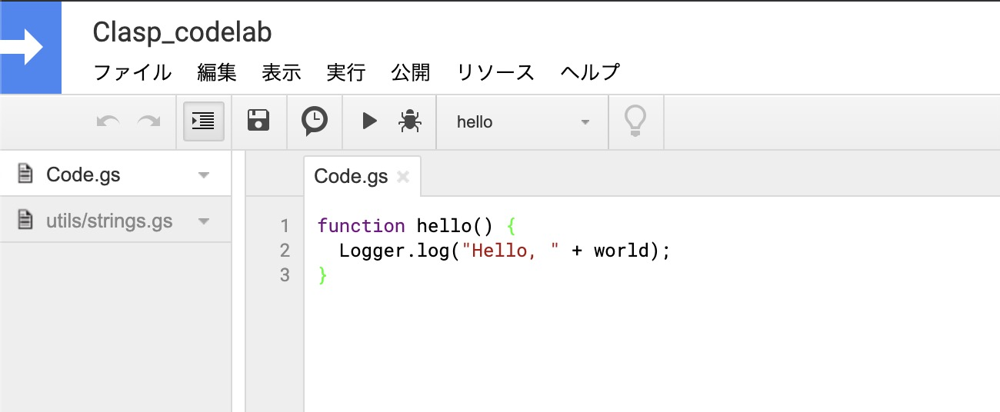
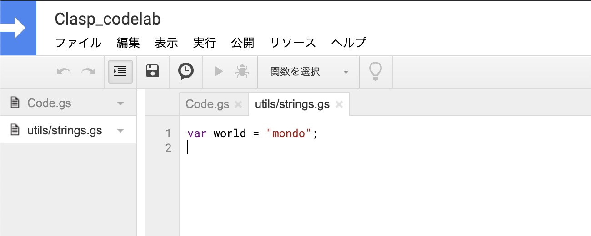

# clasp - The Apps Script CLI

Apps Scriptプロジェクトをローカルで作成、編集、および展開するためのツール。

## codelabs

https://codelabs.developers.google.com/codelabs/clasp/#0

## インストール

```
npm i @google/clasp -g
```

## claspの機能

- ローカル開発: Apps Scriptプロジェクトをローカルで作成、編集、および展開できる。既存のApps Scriptプロジェクトをダウンロードして、ローカルで編集することもできる。
- デプロイメントバージョンの管理: プロジェクトの複数のデプロイメントを作成、更新、および表示できる。
- コードの構造変換: `script.google.com`上のフラットプロジェクトを自動的にフォルダに変換する。

### コードの構造変換の例

`script.google.com`上に以下のスクリプトが存在する場合、

```
├── tests/slides.gs
└── tests/sheets.gs
```

これをローカルにPullすると、`tests`というディレクトリが生成され、その中にスクリプトが展開される。

```
└── tests/
    ├─ slides.gs
    └─ sheets.gs
```

## ログイン

自分のアカウントにApps Scriptプロジェクトを追加するために、以下のコマンドを実行する。

```shell
clasp login
```

コマンド実行すると、ブラウザでGoogleのログイン画面が開くので、そこでログインをし、ターミナルに`Authorization successful.`が表示されれば準備完了。

## プロジェクトの作成

プロジェクトの作成は以下のコマンドを実行する。

```shell
clasp create "プロジェクト名"
```

今回は「sample」という名前のプロジェクトを生成したいので、以下のコマンド実行する。

```shell
clasp create "sample"
```

上記コマンドを実行すると、以下が出力され、プロジェクトのタイプを選択できる。

```
? Clone which script?  (Use arrow keys)
standalone
docs
sheets
slides
forms
webapp
api
```

今回はデフォルトの`standalone`を選択。

プロジェクトの生成が完了すると、以下のファイルが出力される。

```
└─ appsscript.json
```

## スクリプトのPullとPushをする

### ブラウザ上で更新したクラウド上のスクリプトをPullする

以下のコマンドでプロジェクトをブラウザで開けるので、オンラインエディタでクラウド上のスクリプトを更新してみる。

```
clasp open
```

オンラインエディタで **ファイル > 新規作成 > スクリプトファイル** を選択し、`utils/strings`という名前を入力すると、`utils/strings.gs`というファイルが生成される。

`utils/strings.gs`に以下を記述し、

```js
var world = "世界";
```

ルートに存在するファイルである`Code.gs`に以下を記述して保存する。

```js
function hello() {
  Logger.log("Hello, " + world);
}
```

編集後の画面は以下のようになる。



クラウド上のスクリプトをPullするためには、以下のコマンドを実行する。

```
clasp pull
```

今回の場合、コマンド実行後にローカルに`utils/strings.js`と`Code.js`が展開される。

```
└─ utils/strings.js
└─ appsscript.json
└─ Code.js
```

### ローカルのスクリプトをPushする

ローカルの`utils/strings.js`を以下のように変更する。

```js
var world = "mondo";
```

その後以下のコマンド実行する。

```
clasp push
```

Pushが成功すれば、クラウド上のスクリプトが更新される。



## バージョニングとデプロイメント

`clasp`を利用すれば、バージョンとデプロイメントを管理できる。

- バージョン: Apps Scriptプロジェクトの「スナップショット」。デプロイメントに利用される読み取り専用ブランチと見なすことができます。
- デプロイメント: Apps Scriptプロジェクトの公開リリース（多くの場合アドオンまたはWebアプリケーションとして）。バージョン番号が必要。

### バージョンの生成

デプロイをするためにはバージョンが必要なので、まずはバージョンを生成する。

バージョンは以下のコマンド生成できる。

```shell
clasp version "バージョン名"
```

今回は、「First version」というバージョン名を生成する。

```shell
clasp version "First version"

# コマンド実行後、以下の出力がされる。
# 今回は初めてバージョンを生成したため、version 1
Created version 1.
```

`clasp versions`でバージョンを確認できる。

```shell
~ 2 Versions ~
2 - (no description)
1 - First version
```

### デプロイ

```shell
clasp deploy 1 "First deployment"

# コマンド実行後、以下の出力がされる。
Created version 2.
- AKfycbytArwCvGcWFw35nwREeQ_plFOxra24RgmPxpcOGxIlemFWkPO3psq8RTXOUvkwF0An @2.
```

- デプロイ実行時は[Manifests](https://developers.google.com/apps-script/concepts/manifests)が参照される。
- デプロイの詳細は[デプロイメントガイド](https://developers.google.com/apps-script/concepts/deployments)を参照。
