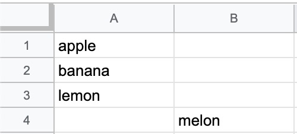
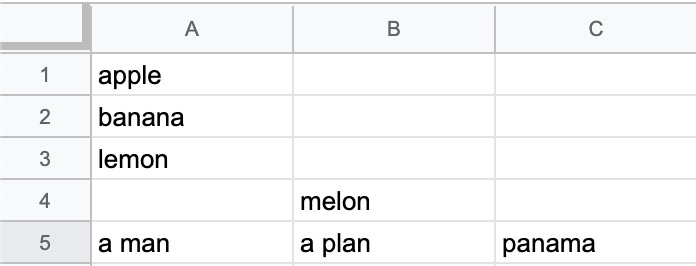

# GASでスプレッドシートを操作してみる

## Google Apps Scriptの初回実行に必要となる承認手順

GASでスプレッドシートなどを利用する場合、認証が必要。

詳細は以下を参照。

- [Google Apps Scriptの初回実行に必要となる承認手順](https://www.virment.com/step-allow-google-apps-script/)

## スプレッドシートの操作

### 書き込み

以下のように`getRange`で書き込み位置を指定し、`setValue`で書き込む値を指定する。

```js
sheet.getRange('A1').setValue(1);
```

上記の場合、A1に`1`が書き込まれる。

#### ループで書き込み

```js
var values = ['apple', 'banana', 'lemon'];
for (var i = 0; i <= values.length; i++) {
  sheet.getRange('A' + (i + 1)).setValue(values[i]);
}
```

この場合、書き込みをするたびにAPI呼び出しが発生しているため、あまりイケていない。

#### 二次元配列を渡してまとめて書き込みをする

以下のように二次元配列を`setValues`メソッドに渡せば、まとめて書き込みができる。

```js
var values = [['apple'], ['banana'], ['lemon']];
sheet.getRange('A1:A3').setValues(values);
```

#### 最後の行に書き込みをする

以下に対して



```js
sheet.appendRow(['a man', 'a plan', 'panama']);
```

を実行すると、以下のように最後の行に書き込みが追加される。



#### シートに記述されている最終行を取得

```js
sheet.getLastRow();
```

以下のシートの場合、4行目が最後に記述されているため、`4`を返す。


以下のように列を指定することもできるが、空白も含めた最終行を取得するため注意。

```js
sheet.getRange("A:A").getLastRow();
```
